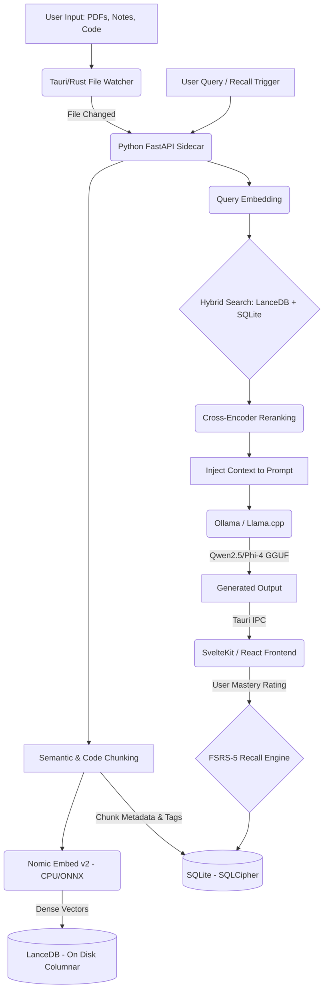

# AI Memory Layer App - Master Project Context & Architectural Blueprint

> **System Purpose:** This document serves as the absolute single source of truth for the AI Memory Layer App. It is engineered to provide instant, high-density context for autonomous AI coding agents, IDE copilots, and human developers to understand the entire technical landscape without ambiguity.

---

## 1. Executive Vision

- **Product Identity:** A local-first, privacy-respecting AI memory engine and knowledge retention system.
- **Core Mission:** To solve "knowledge decay." The system actively prevents users from forgetting what they have learned by transitioning from passive note storage to active, intelligent recall scheduling.
- **Target Audience:** Engineering students, developers, placement aspirants, and researchers operating on standard consumer hardware (e.g., 8GB-16GB RAM laptops).
- **Market Gap:** Existing tools (Notion, Obsidian, Mem.ai) optimize primarily for *knowledge storage and retrieval*. They do not natively optimize for *knowledge retention* using spaced repetition and weak-topic detection models.
- **Differentiation:** 100% offline. Zero cloud API dependencies. Zero recurring costs. Emphasizes placement-prep and technical interview recall.

## 2. Core Product Philosophy

- **Local-First & Offline:** Total independence from the cloud. Data is processed and retained exclusively on the host machine.
- **Privacy-First:** User data is treated as sensitive. It is encrypted at rest and never transmitted externally. Telemetry is non-existent.
- **Learning-Retention-First:** The UI and architecture must prioritize surfacing what the user is *about to forget*, rather than just being a searchable file directory.
- **Solo-Developer & Hardware Optimization:** Architecture must be pragmatic. It must run performantly on average student laptops (CPU inference when GPU is absent) without locking up the OS.

## 3. High-Level Architecture

The system operates as a bifurcated architecture: a lightweight frontend client communicating with an embedded Python ML sidecar.



## 4. Final Recommended Tech Stack

| Component | Technology | Rationale |
| :--- | :--- | :--- |
| **Frontend UI** | **SvelteKit** (or Next.js SSG) | SvelteKit offers zero-runtime compilation, yielding the smallest bundle and fastest UI for Tauri. (Next.js SSG is acceptable if optimizing strictly for React resume keywords). |
| **Desktop Framework** | **Tauri v2 (Rust)** | Uses native OS WebViews (WebView2/WebKit). Drastically lower RAM overhead than Electron. Crucial for apps running local AI models. |
| **Backend ML Sidecar** | **Python (FastAPI)** | The unmatched ecosystem for ML/AI. Packaged via PyInstaller into a standalone executable orchestrated by Tauri. |
| **Vector Database** | **LanceDB** | Embedded, serverless, and stores data on-disk in a columnar format. Infinitely better for scaling beyond RAM limits on local machines compared to Chroma or FAISS. |
| **Metadata Database** | **SQLite + SQLCipher** | Universal, lightweight relational storage for tags, file paths, and FSRS scheduling logs. SQLCipher provides at-rest encryption. |
| **Embedding Model** | **Nomic Embed Text v2** | The 2026 standard for local CPU embedding. 137M parameters, 8192 token context, and Matryoshka dimension truncation for speed. |
| **Local LLM Runtime** | **Ollama** | Easiest daemon-based model management. (Fallback: bare `llama.cpp` bundled if maximum low-latency control is required). |
| **Inference Models** | **Qwen3 (1.5B/3B) / Phi-4-mini** | Qwen dominates coding/structured outputs. Phi dominates reasoning. Both run beautifully on low RAM via 4-bit GGUF quantization. |
| **Scheduling Engine** | **FSRS-5** | Free Spaced Repetition Scheduler. State-of-the-art machine learning algorithm that replaces legacy Anki SM-2 for modeling forgetting curves. |

## 5. Tech Stack Tradeoff Analysis

- **Tauri vs. Electron:** *Rejected Electron.* Electron bundles an entire Chromium instance, consuming 300MB+ RAM at baseline. Tauri uses ~20MB. Since the local LLM and embedding models will consume gigabytes of RAM, the UI shell must be aggressively lightweight.
- **LanceDB vs. ChromaDB/Qdrant:** *Rejected ChromaDB/Qdrant.* Chroma is great for Python prototyping but struggles with large-scale on-disk performance. Qdrant requires a Docker container (heavy). LanceDB embeds directly into the Python process and reads efficiently from disk, avoiding RAM exhaustion.
- **Nomic Embed vs. all-MiniLM-L6-v2:** *Rejected all-MiniLM.* While faster, it lacks long-context support and retrieval accuracy. Nomic v2 provides near-OpenAI quality while running efficiently on CPU via ONNX Runtime.
- **FSRS-5 vs. Custom ML / SM-2:** *Rejected SM-2.* SM-2 is outdated. Building a custom ML model for spaced repetition is over-engineering for V1. FSRS-5 is open-source, highly optimized, and directly addresses the core product value.

## 6. Folder Structure (Monorepo)

```text
/
├── frontend/             # SvelteKit or Next.js UI
│   ├── src/
│   │   ├── components/   # UI components (Tailwind + Shadcn/Skeleton)
│   │   ├── lib/          # State management and Tauri IPC bindings
│   │   └── routes/       # Views (Dashboard, Chat, Settings)
│   └── package.json
├── src-tauri/            # Rust Desktop Host
│   ├── src/
│   │   ├── main.rs       # Entry point, IPC command handlers
│   │   └── sidecar.rs    # Python sidecar lifecycle & port management
│   └── tauri.conf.json
├── sidecar/              # Python FastAPI ML Engine
│   ├── app/
│   │   ├── main.py       # FastAPI router
│   │   ├── models/       # Pydantic schemas for IPC
│   │   ├── ml/           # Embeddings, RAG, Ollama bindings
│   │   ├── db/           # LanceDB and SQLite adapters
│   │   └── memory/       # FSRS-5 implementation
│   ├── requirements.txt
│   └── build.py          # PyInstaller build scripts for Win/Mac/Linux
└── README.md
```

## 7. RAG System Design

1. **Intelligent Chunking:** Use recursive character splitting for prose. For code blocks, implement AST-aware or language-specific chunking to avoid splitting functions in half.
2. **Embedding Generation:** Route text through `Nomic Embed Text v2` (CPU optimized). Truncate output dimensions to 256 to save disk space and drastically speed up vector math.
3. **Hybrid Retrieval:** 
   - *Vector Search:* Semantic similarity via LanceDB.
   - *Metadata Filtering:* Exact match filtering via SQLite (e.g., `WHERE tag='DSA' AND date > '2026-01-01'`).
4. **Reranking:** Pass the top 20 hybrid results through a lightweight Cross-Encoder (e.g., `ms-marco-MiniLM-L-6-v2`) to distill down to the top 3-5 most relevant chunks.
5. **Context Assembly:** Inject the reranked chunks into the LLM prompt with strict citation markers (e.g., `[Source: graph_theory.md]`).

## 8. Memory Intelligence System

The core differentiator. This transforms the app from a database into a "retention engine."

- **The FSRS Log:** Every time a user interacts with a concept (via chat, flashcard, or dashboard prompt), they rate their recall (Again, Hard, Good, Easy). This is logged in SQLite.
- **Forgetting Curve Simulation:** The FSRS algorithm calculates the exact `stability` and `difficulty` of that concept.
- **Weak-Topic Detection:** The backend aggregates FSRS data by tag/subject to generate a "Mastery Score." If a user consistently scores "Again" on "Dynamic Programming," the mastery score drops.
- **Proactive Revision:** The UI dashboard polls the backend for "Due Chunks." It automatically generates a daily revision feed, prioritizing weak topics before the user forgets them entirely.

## 9. AI/ML Components

- **Hardware Graceful Degradation:** The system must assume no dedicated GPU. 
- **ONNX Runtime:** Python sidecar must utilize ONNX Runtime (with AVX512/AMX CPU instructions) for embedding generation to ensure snappy document ingestion.
- **Lazy Loading:** The LLM (Ollama) is only loaded into RAM when a chat session initiates. It is forcibly unloaded after 5 minutes of idle time to return resources to the host OS.
- **Quantization Policy:** Strictly enforce 4-bit (Q4_K_M) GGUF models. 

## 10. Storage Architecture

- **Data Locality:** Original documents remain exactly where the user stores them. The app only stores the indexes.
- **AppLocalData:** All databases (LanceDB directories, SQLite `.db` files) reside in the OS standard local app data folder (e.g., `%APPDATA%` on Windows).
- **Encryption:** The SQLite database containing user schedules and metadata is encrypted using SQLCipher. The decryption key is generated on first launch and stored securely in the OS Native Keychain via Tauri.
- **Backup & Export:** System must support 1-click export of the SQLite database and LanceDB vectors to a compressed archive for user-managed backups.

## 11. Performance Engineering

- **Startup Speed:** Tauri UI must render in < 500ms. The Python sidecar starts asynchronously in the background.
- **Incremental Indexing:** The Rust file watcher computes MD5/SHA256 hashes of files. The Python sidecar only computes embeddings for files whose hashes have changed.
- **Non-Blocking IPC:** Rust to Python communication must be entirely async HTTP/REST or WebSockets. Never block the main Tauri UI thread while waiting for LLM inference.
- **Batched Ingestion:** When indexing a folder, chunks are processed in batches (e.g., 32 at a time) to maximize CPU multi-threading.

## 12. Security & Privacy

- **Absolute Offline Guarantee:** The codebase must contain zero network requests to external APIs (no OpenAI, no telemetry servers). The only network activity is `localhost` communication between Tauri and Python.
- **Sandboxed Execution:** Tauri's `fs` permissions must be strictly scoped. The app can only read directories the user explicitly authorizes.
- **Transparency:** The absence of cloud sync is marketed as a core privacy feature, not a missing capability.

## 13. UI/UX Philosophy

- **Vibe:** "Neo-Brutalism" or "High-End Minimalist Mac App". It should feel like a serious, professional developer tool, not a chaotic student project.
- **Cognitive Clarity:** Eliminate visual clutter. The UI should guide the user immediately to what requires their attention (Due Revisions, Weak Topics).
- **Typographic Hierarchy:** Heavy reliance on whitespace and modern fonts (Inter, Geist, or Roboto) to make long-form reading comfortable.
- **Dark Mode Default:** As a developer tool, a meticulously crafted dark mode is mandatory.

## 14. Feature Roadmap (Solo-Developer Optimized)

- **Phase 1 (MVP - Storage & RAG):** 
  - Tauri + Python sidecar architecture.
  - Basic Markdown parsing and local LanceDB embeddings.
  - Chat interface powered by Ollama.
- **Phase 2 (The Retention Engine):** 
  - FSRS-5 SQLite integration.
  - Flashcard/Revision UI.
  - Dashboard showing Due Reviews.
- **Phase 3 (Intelligence & Analytics):** 
  - Topic Mastery calculation.
  - Heatmaps for study consistency.
  - "Adaptive Difficulty" LLM prompts (e.g., "Explain this based on my current mastery score").

## 15. Engineering Principles

- **Separation of Concerns:** Rust handles the OS (file watching, windows, IPC). Python handles the Math (ML, DBs, Algorithms). Frontend handles the Pixels.
- **Type Rigidity:** Enforce absolute strictness on the IPC boundary. TypeScript interfaces on the frontend must exactly match Pydantic schemas on the backend.
- **Graceful Failure:** The local environment is chaotic. Files will be locked by other programs; RAM will run out. The app must catch these errors gracefully and notify the user without crashing.

## 16. Resume / Portfolio Positioning

- **How to Pitch:** Position this as a "Production-grade Local AI System," not a "Notes App."
- **Key Buzzwords to Emphasize:** Local RAG architecture, Embedded Vector Databases (LanceDB), Inter-Process Communication (Tauri/Rust/Python), CPU/Memory Optimization, Machine Learning Scheduling (FSRS), ONNX Runtime.
- **Recruiter Impact:** Demonstrates the ability to handle full-stack complexity, native OS programming, and deep AI/ML integration without relying on basic OpenAI wrappers.

## 17. Future Scalability

- **Cross-Device Sync (V2+):** Implement peer-to-peer syncing (e.g., using CRDTs or Syncthing protocols) over local Wi-Fi, completely bypassing cloud servers.
- **Multimodal Ingestion:** Add local Whisper.cpp for parsing audio from lecture recordings.
- **IDE Integration:** Expose a local REST API from the sidecar so a VSCode extension can query the memory layer directly while the user writes code.

## 18. Final Engineering Recommendations

- **Where NOT to add complexity:** Do not build a complex rich-text editor from scratch. Use an off-the-shelf Markdown editor component. Focus engineering effort on the retrieval and FSRS pipelines.
- **Smartest MVP Move:** Hardcode the embedding model and LLM first. Build UI options to change models *only after* the core ingestion-to-retrieval loop is flawless. 
- **Biggest Risk:** PyInstaller bundling across different operating systems can be notoriously painful. Set up GitHub Actions early to automate building the Tauri + Python binaries for Windows, Mac, and Linux to catch packaging errors immediately.
